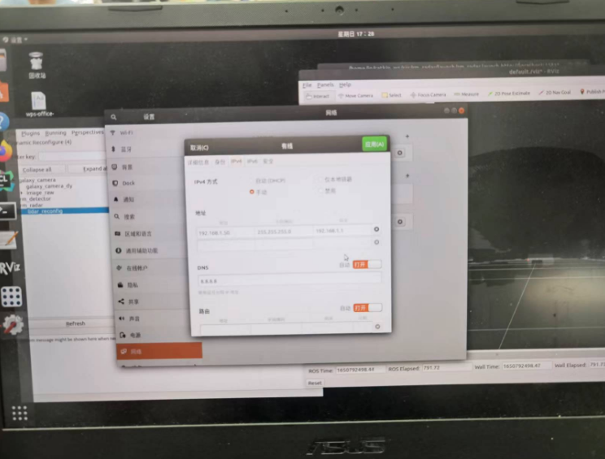
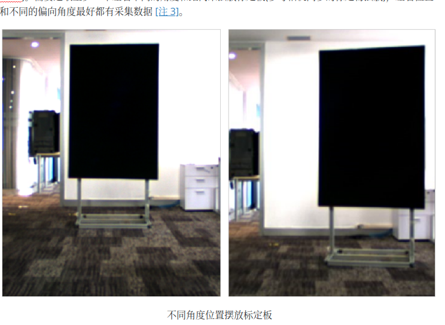
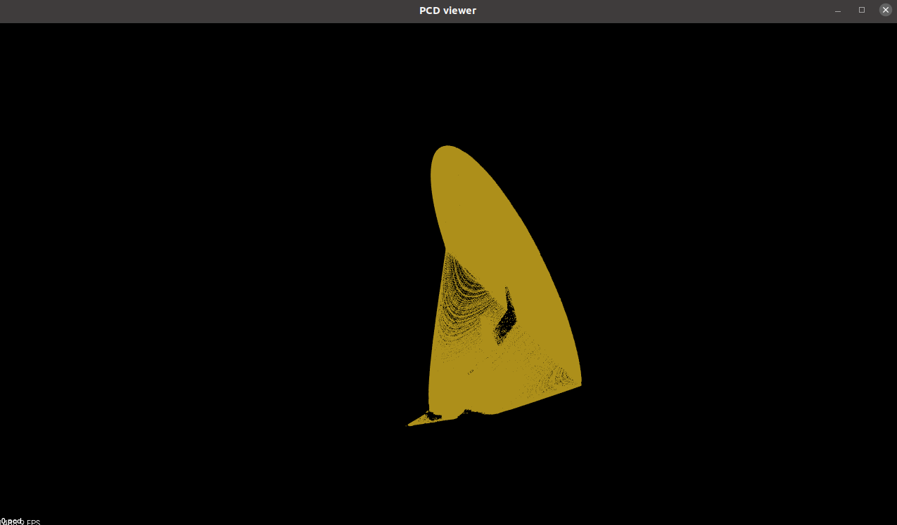
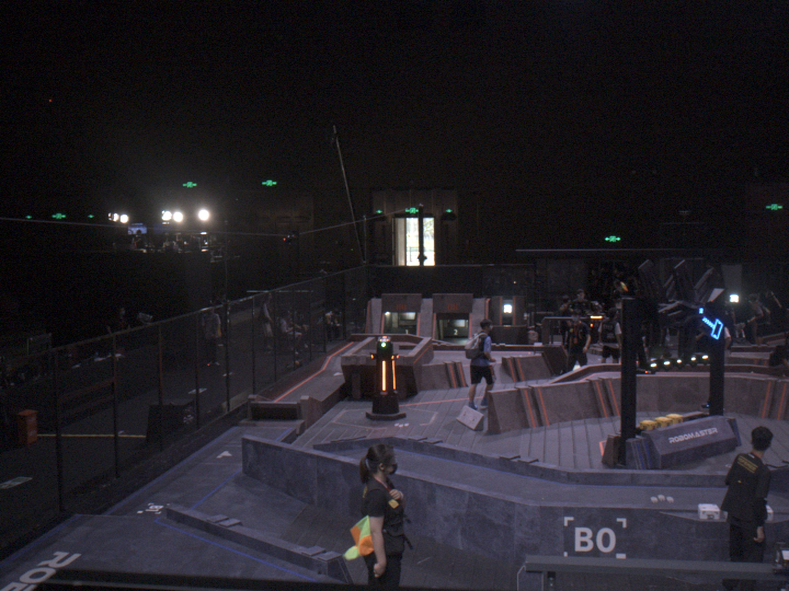
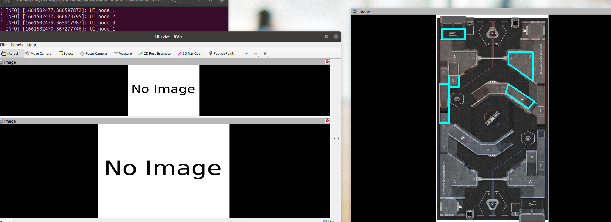
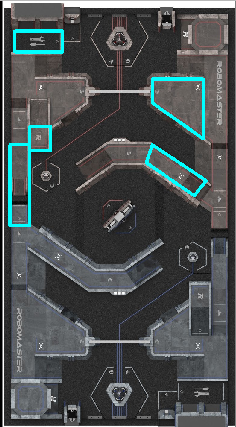

# 雷达代码使用手册

## 1，环境配置

关于livox mid-70雷达的使用环境配置，如果已经有设备配置了相关环境，则可以忽略本部分

以下安装过程最好换清华源或其他源进行，否则速度太慢

### 1）ROS

此步骤使用国内大牛写的一键安装方式，可以安装指定版本的ROS，输入以下代码后，按步骤走即可

```shell
wget http://fishros.com/install -O fishros && . fishros 
```


### 2）Livox 相关

```shell
# 安装Livox_SDK
git clone https://github.com/Livox-SDK/Livox-SDK.git
cd Livox-SDK
sudo ./third_party/apr/apr_build.sh
cd build && cmake ..
make -j8 # 启动8核编译，加快速度
sudo make install

# livox_ros_driver
git clone https://github.com/Livox-SDK/livox_ros_driver.git ws_livox/src
cd ws_livox
# 注意，此处需要将ws_livox中src的内容复制到自己的ros_ws的src中，在切换到ros_ws下用catkin build进行编译
```


### 3）PCL

安装途中可能会遇到一些玄学的bug。。。。

```shell
sudo apt-get update  
sudo apt-get install git build-essential linux-libc-dev
sudo apt-get install cmake cmake-gui
sudo apt-get install libusb-1.0-0-dev libusb-dev libudev-dev
sudo apt-get install mpi-default-dev openmpi-bin openmpi-common 
sudo apt-get install libflann1.9 libflann-dev
sudo apt-get install libeigen3-dev 这个需要自己下载正确版本安装，我的是3.3.7
sudo apt-get install libboost-all-dev
sudo apt-get install libvtk7.1p-qt
sudo apt-get install libvtk7.1p 
sudo apt-get install libvtk7-qt-dev（按照错误提示一步一步安装所需要的东西）
sudo apt-get install libqhull* libgtest-dev
sudo apt-get install freeglut3-dev pkg-config
sudo apt-get install libxmu-dev libxi-dev
sudo apt-get install mono-complete
sudo apt-get install openjdk-8-jdk openjdk-8-jre

# 之后下载pcl包
git clone https://github.com/PointCloudLibrary/pcl.git 
cd pcl 
mkdir release 
cd release

cmake -DCMAKE_BUILD_TYPE=None -DCMAKE_INSTALL_PREFIX=/usr \ -DBUILD_GPU=ON-DBUILD_apps=ON -DBUILD_examples=ON \ -DCMAKE_INSTALL_PREFIX=/usr .. 

make -j8
sudo make install

# 验证
pcl_vi
# 按tab查看补全结果
```


### 4） Ceres Solver

```shell
# CMake
sudo apt-get install cmake
# google-glog + gflags
sudo apt-get install libgoogle-glog-dev libgflags-dev
# Use ATLAS for BLAS & LAPACK
sudo apt-get install libatlas-base-dev
# Eigen3
sudo apt-get install libeigen3-dev
# SuiteSparse and CXSparse (optional)
sudo apt-get install libsuitesparse-dev

# 之后，下载ceres solver的包，可能网络问题，需要挂梯子上github下载，总之想办法弄到这个包
git clone https://ceres-solver.googlesource.com/ceres-solver

tar zxf ceres-solver-2.1.0.tar.gz
mkdir ceres-bin
cd ceres-bin
cmake ../ceres-solver-2.1.0
make -8
make test
# Optionally install Ceres, it can also be exported using CMake which
# allows Ceres to be used without requiring installation, see the documentation
# for the EXPORT_BUILD_DIR option for more information.
sudo make install

# 验证
bin/simple_bundle_adjuster ../ceres-solver-2.1.0/data/problem-16-22106-pre.txt
# 会出现类似下列数据：：
  iter      cost      cost_change  |gradient|   |step|    tr_ratio  tr_radius  ls_iter  iter_time  total_time
     0  4.185660e+06    0.00e+00    1.09e+08   0.00e+00   0.00e+00  1.00e+04       0    7.59e-02    3.37e-01
     1  1.062590e+05    4.08e+06    8.99e+06   5.36e+02   9.82e-01  3.00e+04       1    1.65e-01    5.03e-01
     2  4.992817e+04    5.63e+04    8.32e+06   3.19e+02   6.52e-01  3.09e+04       1    1.45e-01    6.48e-01
     3  1.899774e+04    3.09e+04    1.60e+06   1.24e+02   9.77e-01  9.26e+04       1    1.43e-01    7.92e-01
     4  1.808729e+04    9.10e+02    3.97e+05   6.39e+01   9.51e-01  2.78e+05       1    1.45e-01    9.36e-01
     5  1.803399e+04    5.33e+01    1.48e+04   1.23e+01   9.99e-01  8.33e+05       1    1.45e-01    1.08e+00
     6  1.803390e+04    9.02e-02    6.35e+01   8.00e-01   1.00e+00  2.50e+06       1    1.50e-01    1.23e+00

Solver Summary (v 2.1.0-eigen-(3.4.0)-lapack-suitesparse-(5.10.1)-cxsparse-(3.2.0)-acceleratesparse-eigensparse-no_openmp)

                                     Original                  Reduced
Parameter blocks                        22122                    22122
Parameters                              66462                    66462
Residual blocks                         83718                    83718
Residuals                              167436                   167436

Minimizer                        TRUST_REGION

Dense linear algebra library            EIGEN
Trust region strategy     LEVENBERG_MARQUARDT

                                        Given                     Used
Linear solver                     DENSE_SCHUR              DENSE_SCHUR
```


## 2，Livox mid-70雷达使用

首先需要配置一下静态IP：



设置-网络-有线-IPV4

地址： 

192.168.1.50              255.255.255.0                      192.168.1.1

DNS: 8.8.8.8


之后给雷达上电，雷达运行起来的时候，会发出明显的声音，类似散热？可以留意一下。将网线通过某些拓展坞连接到电脑

连接不上可能需要别的拓展坞，或者将其他无线网络断开试试

连接上后，可用以下代码测试：

```shell
# 首先要来到自己的ros工作空间下
roslaunch livox_ros_driver livox_lidar_rviz.launch
# 看看能不能在rviz中看到扫描的点云消息
```


 
## 3，相机雷达联合标定过程

可参考livox官方给出的包进行：

```shell
git clone https://github.com/Livox-SDK/livox_camera_lidar_calibration.git
# 将camera_lidar_calibration这个包放在自己的ros_ws/src中，在ros_ws/下catkin build编译
```

内部标定过程叙述的还是挺详细的，可按照包内部的markdown文件进行，如果已经已经完成了环境配置和相机内参标定，可以跳过文件的第一、二大部分，直接看第三部分（PCL安装时，一般也会一起装上Eigen，如果没有还是要按步骤安装才能进行下一步）

这里补充几点必要的说明：

1）标定板并非必要



就是这一步骤，其实可以选择其他边缘痕迹明显的位置，例如楼梯、楼层边缘等等，不一定非要标定板的角点，其他角点明显的地方也可以，联合标定原理就是这样：

1. 记录相机拍摄的照片

2. 记录雷达扫描的rosbag数据，之后转成pcd文件，就是扫描到的点云文件（很多点），类似于下图：



3. 获得照片和pcd点云文件之后，就可以使用包内的程序来获取照片中的角点坐标和对应的点云数据的角点坐标。
4. 最后根据照片角点和对应的点云数据角点，计算用来实现两个坐标系互相转换的外参矩阵

2）文件中的录制点云数据

```shell
roslaunch livox_ros_driver livox_lidar_rviz.launch
# 看看能不能在rviz中看到扫描的点云消息，此时不能直接录制rosbag，因为此时录制的bag数据格式有问题，要使用下面的指令之后，才能录制
# 若能看到则运行下面的指令
roslaunch livox_ros_driver livox_lidar_msg.launch
# 之后运行录制指令
rosbag record /livox/lidar # 录制半分钟左右，全程无人遮挡
```

剩下的其他就按照包内md文件做就就可以了。


## 4，雷达代码

主要分为相机检测和雷达部分，总启动文件：radar_double_camera.launch，注：以下步骤是相机内参标定和相机雷达联合标定完成后，才能启动的。

启动指令：```roslaunch rm_radar radar_double_camera.launch```

相机的内参标定：参照网上的棋盘格标定程序即可

联合标定可参考;https://github.com/Livox-SDK/livox_camera_lidar_calibration/blob/master/README.md

输入启动后会跳出rviz的界面和两张图片，两张图片分别是左右摄像头分别在现场拍摄的图片，需要人手动根据：

rm_radar/config/mouse_callback_config_left.yaml

rm_radar/config/mouse_callback_config_right.yaml

中的三维点，依照顺序点击拍摄到图片中的二维点。例如：

```yaml
#left_camera
  p1: [ 0.927998, 0.926115, -1.531]
  p2: [2.891553, 11.815893, -1.447749]
  p3: [ 8.311249, 14.811249, -2.386 ]
  p4: [ 1.61, 16.712008, -0.735 ]
  p5: [6.197724, 19.666201, -0.614995]
  p6: [ 6.857724, 19.666201, -0.614995 ]
  # 关于这些点，是机械组比赛场地的三维模型给出的点，坐标原点和点所分别代表的具体位置具体可以再调整
 
```

（假如）第一个点p1是左边摄像头拍摄到的风车的中心点，就要点击左边摄像头采集的图像中风车的中心点：



就是风车中心蓝色的那个点，其他点同理，记得，一定要按参数mouse_callback_config_right.yaml文件中点的顺序进行点击，不然计算出来的转换矩阵不精确。

点击完成后，雷达即可获悉自己在赛场的位置，并开始后续代码的运行。

最后效果类似于下图：



注意！！！1

图片的路径要在rm_radar radar_double_camera.launch中设置好！！

以下简要介绍一下雷达代码组成。


### 4.1 rm_detector_tensorRT

这一部分代码主要是由现视觉组成员江楠维护，主要是调用海康的相机画面进行目标检测，用训练好的模型进行检测。并将检测到的对象的roi发布到话题上

话题名称：left_camera_proc/roi_data1（2，3，4，5）

另外其他话题参数可见于armor_detector.launch


### 4.2 rm_radar

雷达代码主体，分为雷达部分和UI部分

雷达部分主要是在lidar.cpp

主要负责将激光雷达和相机信息组合，进行处理，输出检测到目标的真实三维坐标

小地图界面主要是UI.cpp，这一部分的代码主要是订阅lidar.cpp发出的检测到目标的三维坐标信息

关于英雄是否进入标准吊射位置，可在这里进行标注

具体代码运作都在各个.cpp文件中详细注释，可参照阅读和修改，关于世界坐标转换到相机坐标系再转换到图像坐标系的部分，这些转换关系的代码应该不用修改了。


### 4.3 参数设置说明

相机的参数主要在```config/camera_left.yaml```和```config/camera_right.yaml```内设置，包括：

```yaml
camera_matrix：相机内参矩阵
distortion_coefficients：畸变矩阵
projection_matrix：投影矩阵
extrinsic：相机雷达联合标定的转换矩阵？
```


map.yaml：主要是用于Opencv函数绘制预警区域：




mouse_callback_config_left.yaml：记录三维坐标点，主要用于和radar_double_camera.launch运行后，认为点击的图像坐标一一对应，为solvePnP操作准备参数。

mouse_callback_config_right.yamlL：同理


radar_double_camera.launch参数设置：

记得拍摄新照片之后，调整一下读取图片的路径即可，剩下的其他可以暂时不动

```launch
<param name="img_path" value="$(find rm_radar)/config/left_camera_proc_4992.jpg"/>
```

